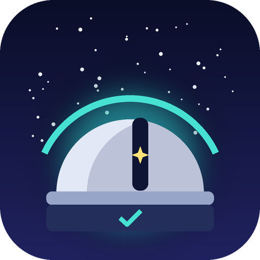

<p align="center"></p>

# SkyWarden

An observatory safety monitor for Windows. SkyWarden checks the sky and weather every 15 minutes and parks your mount when conditions turn unsafe. It can also switch your dew heater and read a local cloud or safety sensor.

It works with **ASCOM**, **Alpaca** and **INDI** equipment.

> **Status:** early version. The Alpaca and INDI code has been tested against mock servers only. The classic ASCOM code has not been tested, and nothing has been tried on real hardware. Test with simulators before trusting it with real equipment.

## What it does

- **Safety checks** every 15 minutes (and on demand):
  - Target altitude is above your minimum horizon limit.
  - Wind gusts, cloud cover and rain are within your limits (live data from Open-Meteo).
  - A local ASCOM, Alpaca or INDI safety monitor or cloud sensor reads safe.
  - If the weather lookup or sensor can't be read, SkyWarden treats conditions as unsafe.
- **Parks the mount** when conditions are unsafe, when you press the emergency button, or when the watchdog sees the check loop stall for more than 20 minutes. If a park fails, it retries 3 times and then alerts you to park by hand.
- **Controls a dew heater** (ASCOM or Alpaca Switch device): on when the temperature is within your set margin of the dew point, off otherwise.
- **Finds devices** by scanning for ASCOM drivers on the PC, Alpaca servers on the LAN and INDI servers on your subnet.
- **300+ built-in targets:** every Messier and Caldwell object, other well-known named objects and the planets and Moon. Type in the target box to search, or add your own in `my_targets.csv` (see [Targets](#targets)).
- **Phone alerts (optional):** sends a notification to your Android phone through [ntfy](https://ntfy.sh) when conditions turn unsafe, when the mount has parked, when a park fails (urgent), on emergency abort and when the watchdog fires. See [Phone alerts](#phone-alerts).
- **Three themes**, including an all-red night-vision theme.
- **Log:** everything is written to `skywarden_log.txt` and shown in the app.

## Requirements

- Windows 10 or 11
- Python 3.10 or newer
- Libraries: PyQt6, requests, ephem, pywin32 (see `requirements.txt`)

## Quick start

```
cd /d C:\skywarden
python -m venv venv
venv\Scripts\activate
pip install -r requirements.txt
python skywarden.py
```

See [INSTALL.md](INSTALL.md) for the full guide, hardware driver notes and troubleshooting.

## Using it

1. Open the **Hardware & Configuration** tab and click **Scan**.
2. Choose your mount, dew heater and cloud sensor, and set the **Dew Heater Switch ID**.
3. Set your safety limits and click **Save Settings**.
4. On the dashboard, check your latitude and longitude and pick a target.
5. Click **Force Run Verification** to try one check.
6. Click **Initialize Automated Monitoring Loop** to start monitoring.
7. **EMERGENCY ABORT** stops monitoring and parks the mount.

## Targets

The target box on the dashboard lists:
- **Solar system:** Mercury, Venus, the Moon, Mars, Jupiter, Saturn, Uranus and Neptune. The Sun is left out on purpose, because aiming a telescope at it without a proper solar filter can destroy the equipment and cause blindness.
- **Deep sky:** all 109 Messier objects (M102 is left out because it duplicates M101), all 109 Caldwell objects, and other objects with a common name, such as the Horsehead Nebula. Each entry shows its other catalogue names, so you can search "NGC 7000", "C 20" or "North America".

Click the box and start typing to search. You can also type an exact name, such as `m31`, `NGC7000` or `Andromeda Galaxy`. Partial text is never guessed: SkyWarden suggests matches instead, so a typo can't quietly pick the wrong object.

**Adding your own targets:** copy `my_targets.example.csv` to `my_targets.csv` (in the folder you run SkyWarden from) and add one line per object:

```
name,ra,dec,description
Polaris,02:31:49,+89:15:51,North Star
```

- `ra` is in **hours** (0 to 24), not degrees, and `dec` is in degrees, both J2000.
- Press the reload button (↻) next to the target box after editing. Problem lines are skipped and listed in the log.
- A name that matches a built-in target replaces it.
- Moving objects such as comets and asteroids aren't supported, because their positions change every night.

## Phone alerts

1. Install the free **ntfy** app on your Android phone and subscribe to a topic with a long random name, such as `skywarden-k7x92qmfa4`. The topic works like a password, so anyone who knows it can read your alerts.
2. In SkyWarden, open **Hardware & Configuration**, type the same topic into **Phone Alerts (ntfy)**, and click **Save Settings**.
3. Click **Send Test Alert** to check it works.

To get alerts while the phone is on silent, open the ntfy app's notification settings in Android and turn on **Override Do Not Disturb** for the urgent channel. Test this with your phone on silent, because Android versions differ.

The topic is stored in `config_skywarden.json`, which is not uploaded to GitHub. If an alert can't be sent (no internet, for example) it is logged and nothing else is affected. A phone alert is not a safety system: keep hardware safeguards in place.

## What works with what

| Feature | ASCOM | Alpaca | INDI |
|---|---|---|---|
| Find devices | Yes (this PC only) | Yes (LAN) | Yes (your subnet) |
| Park mount | Yes | Yes | Yes |
| Dew heater | Yes | Yes | No |
| Cloud / safety sensor | Yes | Yes | Partial (weather status only) |

Classic ASCOM only finds drivers installed on the same PC. Remote ASCOM devices appear through Alpaca.

## Files

| File | Purpose |
|---|---|
| `skywarden.py` | The application |
| `catalog.py` | Built-in target list (data from OpenNGC, see Licence) |
| `my_targets.example.csv` | Example for your own targets (copy to `my_targets.csv`) |
| `requirements.txt` | Python libraries to install |
| `pyproject.toml` | Package metadata (`pip install .`) |
| `INSTALL.md` | Step-by-step install guide |
| `LICENSE` | GPL-3.0 licence text |
| `assets/skywarden.ico` | App icon, shown in the window and taskbar (keep the `assets` folder next to `skywarden.py`) |
| `assets/skywarden_icon_512.png` | Large icon image used in this README |
| `.github/workflows/main.yml` | Builds `SkyWarden.exe` on GitHub with PyInstaller |
| `config_skywarden.json` | Your saved settings (created on first save) |
| `skywarden_log.txt` | Activity log (created on first run) |

## Known limitations

- The INDI dew heater is not supported, because the property names differ per driver.
- The INDI weather check is a best guess: it treats a weather status of "Alert" as unsafe.
- The mount parks, but SkyWarden does not close roofs or domes.
- The device scan only covers your own subnet.
- A software safety monitor is a backup, not a replacement for hardware safeguards. Don't leave expensive equipment relying on it alone.

## Licence

SkyWarden is free software, released under the [GNU General Public License v3.0](LICENSE) (GPL-3.0-only).

**Target data:** the built-in target list in `catalog.py` is a filtered extract of [OpenNGC](https://github.com/mattiaverga/OpenNGC) by Mattia Verga and contributors, which is licensed under [CC BY-SA 4.0](https://creativecommons.org/licenses/by-sa/4.0/). Creative Commons lists CC BY-SA 4.0 material as one-way compatible with GPLv3, so it can be used in a GPLv3 project; keep this credit if you redistribute the data.
